# Altron - Product Documentation

## What is Altron?

Altron is a password manager that keeps your passwords on your computer instead of in the cloud. It's free, works offline, and doesn't require an account.

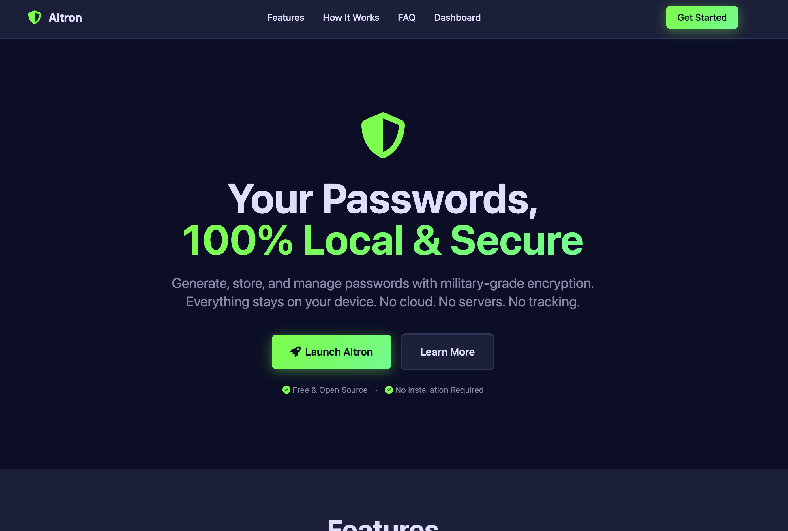

---

## Features

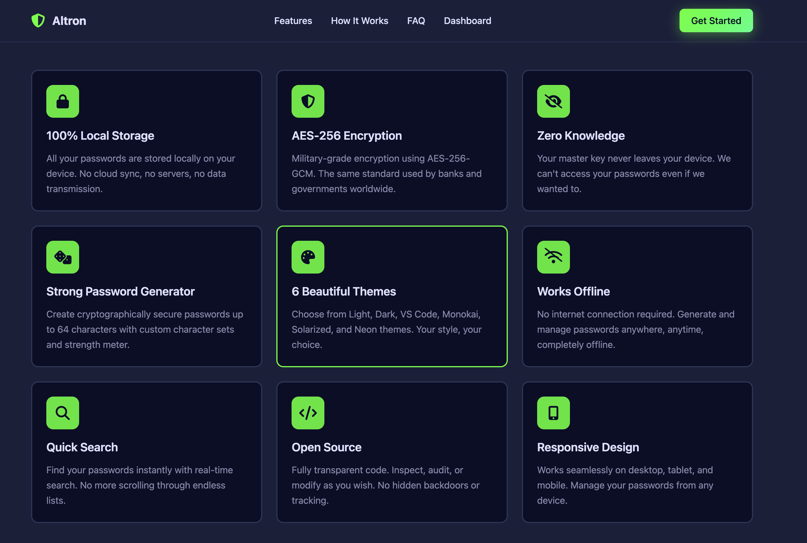

### Password Generator

Create strong, random passwords instantly.

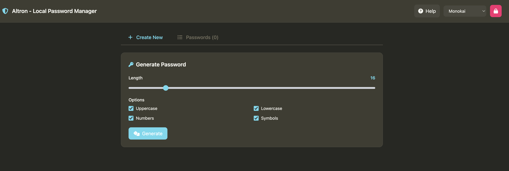

- Choose password length (8-64 characters)
- Pick which characters to include (letters, numbers, symbols)
- See password strength as you adjust settings
- Generate with one click

After generating, save it with a label like "Netflix" or "Bank Account" so you can find it later.

---

### Password Storage

All your passwords in one place, searchable and organized.

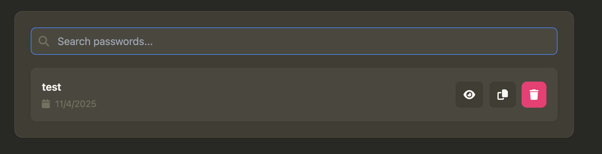

- Search by typing the label
- Click to view any saved password
- Copy to clipboard with one click
- Delete passwords you don't need anymore

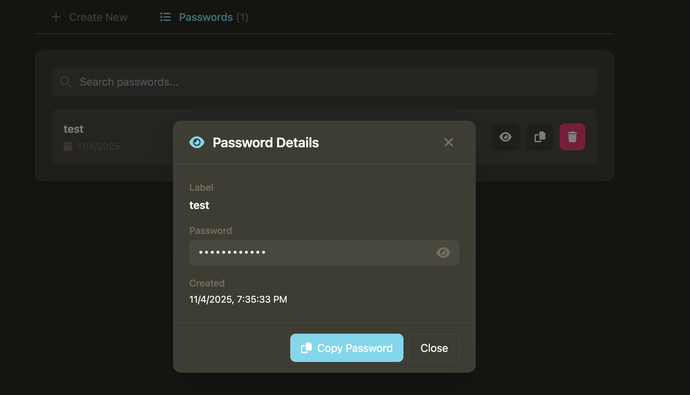

Passwords stay hidden until you click to reveal them.

---

### Master Key

One password protects everything.

- Create a master key when you first open Altron
- Use it to unlock your passwords each time
- Lock the app when you step away

Your master key is never saved anywhere - only you know it.

---

### Themes

Choose the look you prefer.

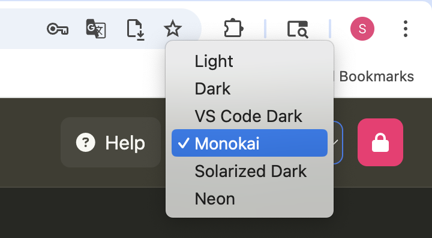

Six color options: Light, Dark, VS Code Dark, Monokai, Solarized Dark, and Neon.

Your choice is remembered next time you open Altron.

---

### Help

Guidance when you need it.

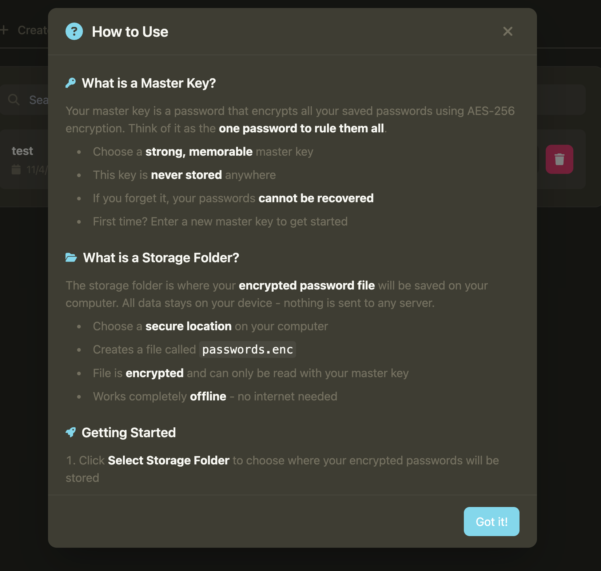

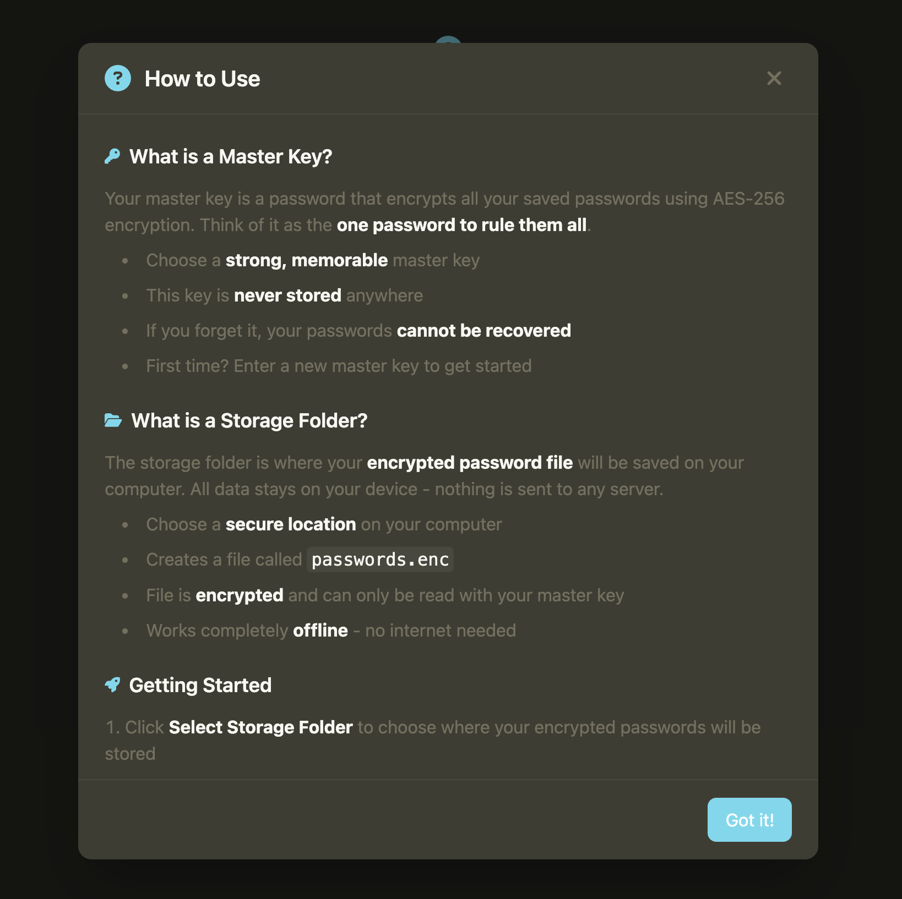

Built-in help explains features and best practices.

---

## How It Works

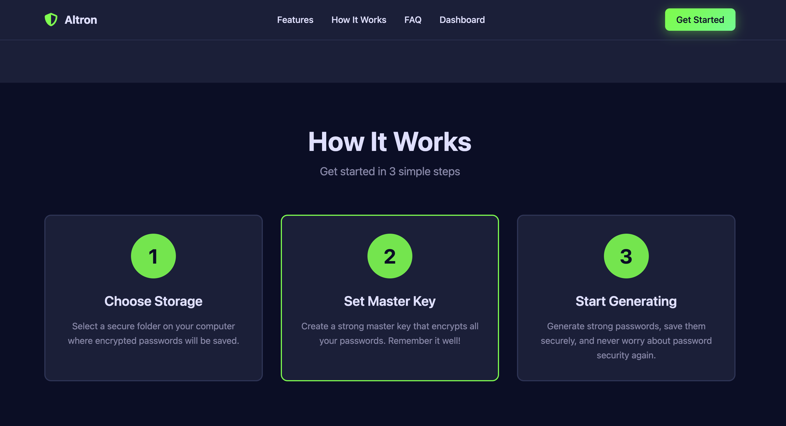

1. **Select a folder** on your computer where passwords will be saved
2. **Create a master key** that encrypts your passwords
3. **Generate and save** passwords as you need them
4. **Search and copy** when logging into websites

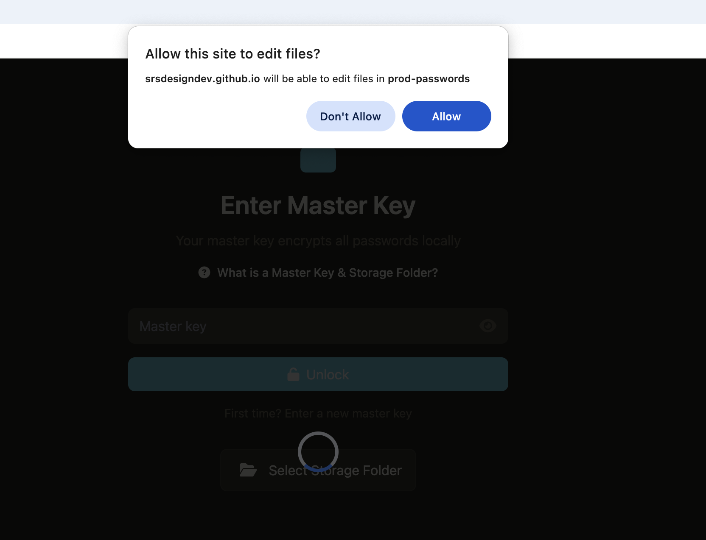

Your browser asks permission once to access the folder you chose.

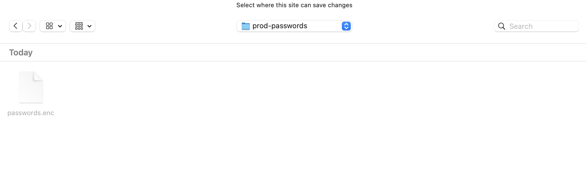

Everything is encrypted and stored locally - nothing goes online.

---

## Use Cases

### For Personal Use

**Situation:** You have accounts on 50+ websites and struggle to remember unique passwords for each.

**With Altron:**
- Generate a unique password for every account
- Label each one clearly ("Amazon", "Work Email", "Gym Membership")
- Search when you need to log in
- Copy and paste the password

**Result:** Every account has a strong, unique password you don't need to memorize.

---

### For Privacy-Focused Users

**Situation:** You don't trust cloud services with your sensitive data.

**With Altron:**
- All passwords stay on your computer
- Nothing is sent to any server
- No account registration required
- You control your data completely

**Result:** Complete privacy and control over your passwords.

---

### For Offline Access

**Situation:** You travel frequently or work in places with poor internet.

**With Altron:**
- Works without internet connection
- Generate passwords offline
- Access saved passwords anytime
- No sync delays or connection issues

**Result:** Full functionality regardless of connectivity.

---

### For Developers

**Situation:** You manage API keys, database passwords, and test account credentials.

**With Altron:**
- Store all development credentials
- Organize by project name
- Quick search and copy while coding
- Keep sensitive keys off the cloud

**Result:** Organized credential management without security risks.

---

### For Shared Computers

**Situation:** Multiple people use the same workstation at a small office.

**With Altron:**
- Each person has their own encrypted file
- Individual master keys keep passwords separate
- Lock when leaving your desk
- No shared account vulnerabilities

**Result:** Personal password security on shared devices.

---

## Benefits

### Privacy
- Your passwords never leave your computer
- No company has access to your data
- No tracking or data collection
- Complete anonymity

### Security
- Strong encryption protects your passwords
- Only you have the master key
- No password recovery means no security backdoor
- Open source code you can verify

### Simplicity
- No account setup required
- No subscription fees
- Clean, simple interface
- Works offline

### Control
- You own your password file
- Choose where to store it
- Back it up how you want
- No vendor lock-in

---

## Frequently Asked Questions

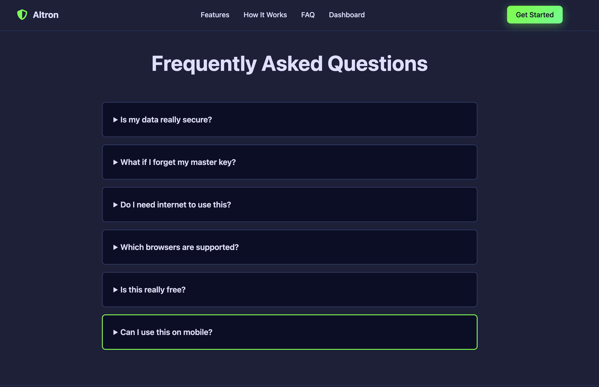

**Can I use Altron on my phone?**  
No, it only works on computers with Chrome or Edge browser.

**What if I forget my master key?**  
Your passwords cannot be recovered. This is by design for security.

**Can I sync between devices?**  
No automatic sync. You can manually copy the encrypted file between computers.

**Does it work offline?**  
Yes, completely. No internet needed.

**How much does it cost?**  
Free. No subscription or premium version.

**Can others access my passwords?**  
Only if they have physical access to your computer and know your master key.

---

## Product Comparison

### Altron vs Cloud Password Managers

**Altron:**
- ✅ Free forever
- ✅ Complete privacy
- ✅ Works offline
- ✅ No account needed
- ❌ No sync across devices
- ❌ No auto-fill in browsers
- ❌ No mobile app

**Cloud Services (LastPass, 1Password, Bitwarden):**
- ❌ Subscription fees
- ❌ Data on company servers
- ❌ Needs internet
- ❌ Account required
- ✅ Syncs everywhere
- ✅ Auto-fill support
- ✅ Mobile apps

**Choose Altron if:** Privacy matters more than convenience  
**Choose cloud services if:** You need multi-device access

---

### Altron vs Browser Password Managers

**Altron:**
- ✅ Stronger encryption
- ✅ Works across all browsers
- ✅ Password generator
- ✅ Open source
- ❌ Manual copy/paste

**Browser Managers (Chrome, Firefox, Safari):**
- ❌ Tied to one browser
- ❌ Less control
- ❌ Weaker security
- ✅ Auto-fill built in
- ✅ Simpler to use

**Choose Altron if:** You want proper security and control  
**Choose browser if:** Simple built-in solution is enough

---

## Limitations

**What Altron Doesn't Do:**
- Sync across devices
- Auto-fill passwords in browsers
- Work on mobile phones
- Share passwords with others
- Import from other password managers
- Recover forgotten master keys

**Why These Limitations Exist:**
These features would require cloud services, which would compromise the privacy-first design.

---

## Getting Started

1. Open Altron in Chrome or Edge
2. Select a folder to store your passwords
3. Create a master key
4. Start generating and saving passwords

It takes about 30 seconds to set up.

---

## Summary

Altron is for people who want a simple, private way to manage passwords without cloud services. It trades convenience features like sync and auto-fill for complete privacy and offline functionality.

**Best for:**
- Privacy-focused users
- Single-device use
- Offline scenarios
- Simple password management

**Not for:**
- Multi-device synchronization
- Browser auto-fill
- Mobile access
- Team password sharing

The product is intentionally simple: generate strong passwords, store them securely on your computer, and access them when needed. Nothing more, nothing less.

---

**Version:** 1.0.0  
**License:** MIT (Open Source)  
**Platform:** Chrome/Edge Browser  
**Cost:** Free